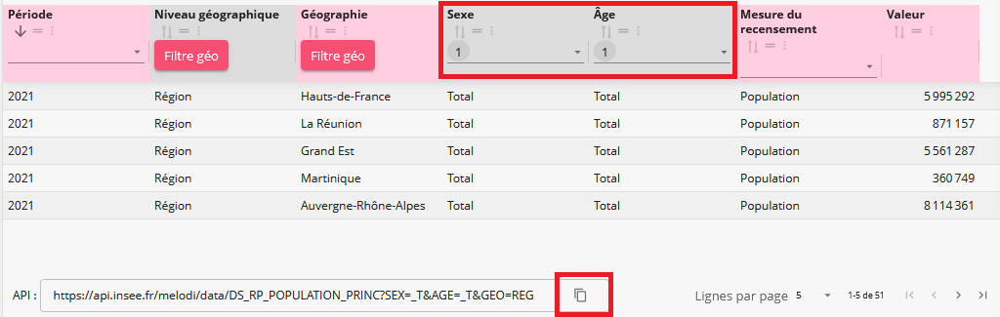

```{r, include = FALSE}
knitr::opts_chunk$set(
  collapse = TRUE,
  comment = "#>"
)
```

```{r setup, echo = FALSE}
library(melodi)
```

# Ajuster sa requête via l'explorateur

En navigant [dans le catalogue de données de l'Insee](https://catalogue-donnees.insee.fr), choisir son jeu de données, puis dans l'onglet Données, cliquer sur Explorateur.

En utilisant les filtres appliquables sur chaque colonne, ajuster une requête filtrée répondant à son besoin.

En bas de page, copier l'URL API correspondant.

```{r out.width = '100%', echo = FALSE, fig.cap="Vue explorateur"}

```

# Charger les données associées grâce à la requête

A l'aide de la fonction `get_data()`, passer en paramètre la requête copiée. En retour le résultat est obtenu sous forme de data.frame.

```{r requete-filtre, eval = FALSE}
data <- get_data("https://api.insee.fr/melodi/data/DS_RP_POPULATION_PRINC?SEX=_T&AGE=_T&GEO=REG")
```

**Avertissement :** cette fonction est limitée à un retour de 10 000 résultats, au delà, filtrer davantage sa requête ou passer plutôt par un chargement complet du jeu de données via `get_all_data()` et filtrer a posteriori en R.
